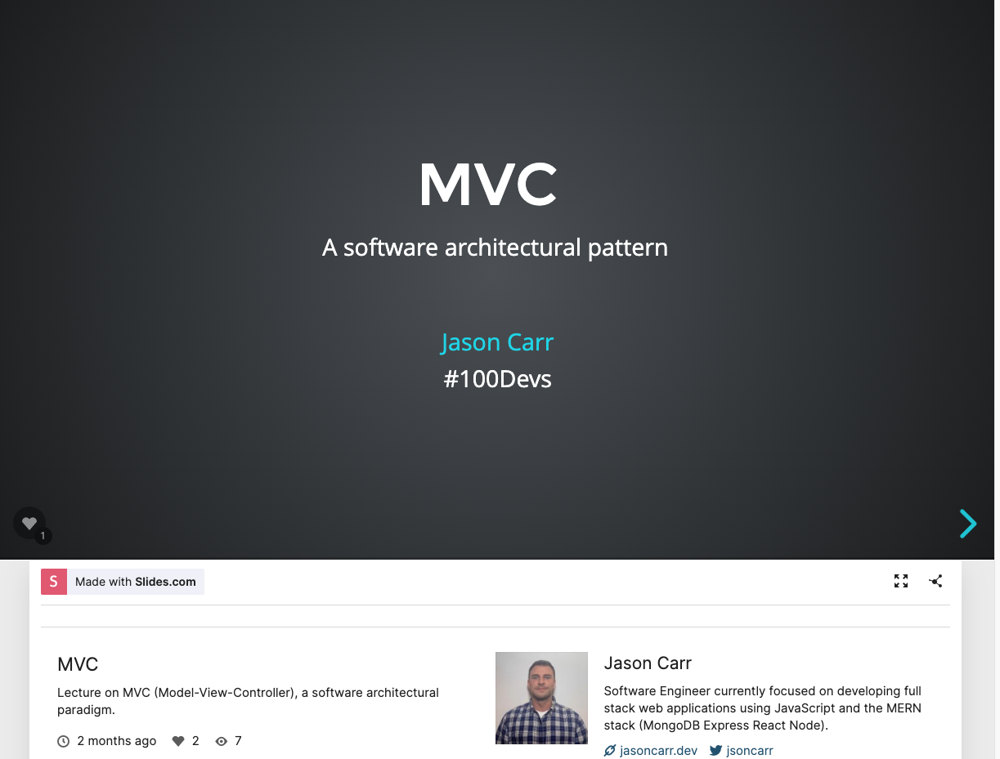

# MVC-lecture

This is the repository for my lecture on MVC (Model-View-Controller), a software architectural paradigm.

## Link to the lecture slides [Here](https://slides.com/jsoncarr/mvc)

## Templates to start an MVC project

[Express's MVC Template](https://github.com/expressjs/express/tree/master/examples/mvc)

[Simple MVC Project Template](https://github.com/jasoncarr95/MVC-lecture-jasoncarr/tree/main/MVC-Project-Template)
